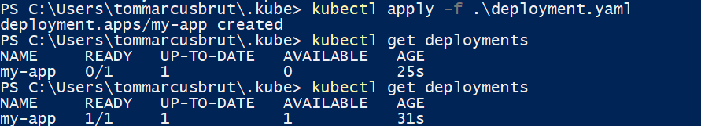
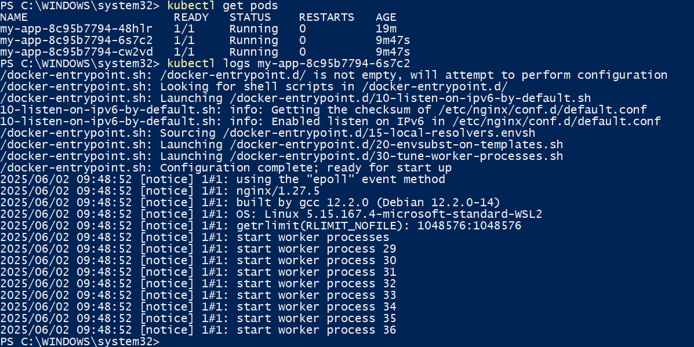
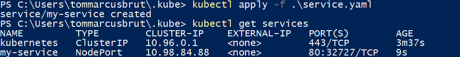
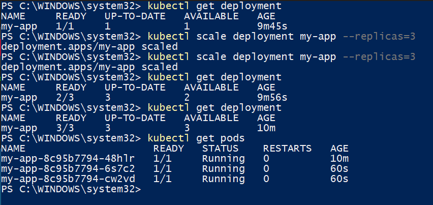
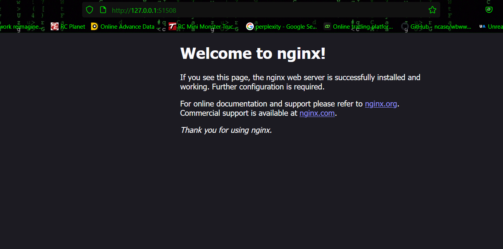
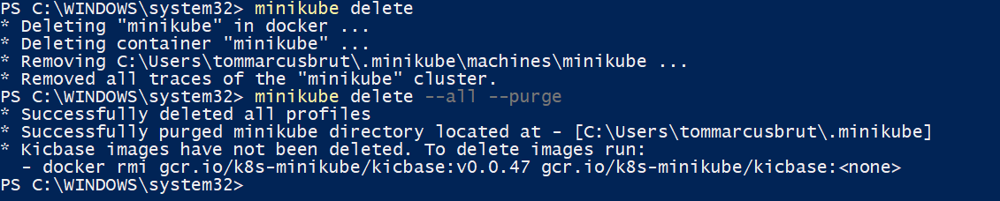

# Kubernetes Deployment with Minikube

This repository contains YAML configurations and execution steps to deploy and expose an application on a local Kubernetes cluster using **Minikube**.

---

## 🚀 Task Overview

**Internship Task 5**:  
Set up a Kubernetes cluster locally using Minikube, deploy an application, expose it via a service, and scale the deployment.

---

## 🧰 Tools & Versions

- **Minikube** v1.36.0  
- **kubectl** v1.33.1  
- **Docker**  
- **Windows with WSL2 backend**

---

## 📁 Files Included

- `deployment.yaml`: Defines a deployment of an NGINX-based application with initial 1 replica.
- `service.yaml`: Exposes the app using a NodePort service.
- `screenshots/`: Terminal and browser screenshots showing successful deployment, scaling, and exposure.

---

## 🔧 Setup & Commands Used

### 1. Start Minikube
```bash
minikube start
```

### 2. Deploy Application
```bash
kubectl apply -f deployment.yaml
```


### 3. Expose Deployment via Service
```bash
kubectl apply -f service.yaml
```


### 4. Verify Resources
```bash
kubectl get deployments
kubectl get pods
kubectl get services
```




### 5. Scale Deployment
```bash
kubectl scale deployment my-app --replicas=3
```

### 6. Access the App
```bash
minikube service my-service
```


### 7. delete the minikube profile

```bash
minikube delete
```

